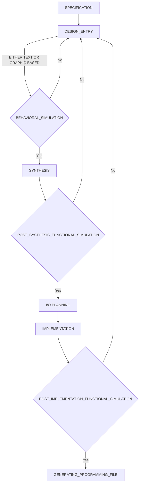

# FPGA DESIGN FLOW CHART

Here is a simple flow chart:

```mermaid
flowchart TD
    SPECIFICATION --> A
    A[DESIGN_ENTRY] -->|EITHER TEXT OR GRAPHIC BASED| B{BEHAVIORAL_SIMULATION}
    B -->|Yes| C[SYNTHESIS]
  
    
    C --> D{POST_SYSTHESIS_FUNCTIONAL_SIMULATION}
    D --> |Yes| E[I/O PLANNING] --> F[IMPLEMENTATION];
    F --> G{POST_IMPLEMENTATION_FUNCTIONAL_SIMULATION}
    G --> |Yes| H[GENERATING_PROGRAMMING_FILE]
    G ---->|No| A
    D ---->|No| A
    B ---->|No| A
```
